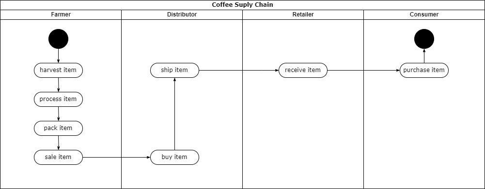
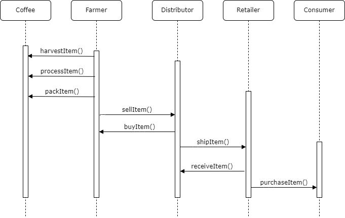
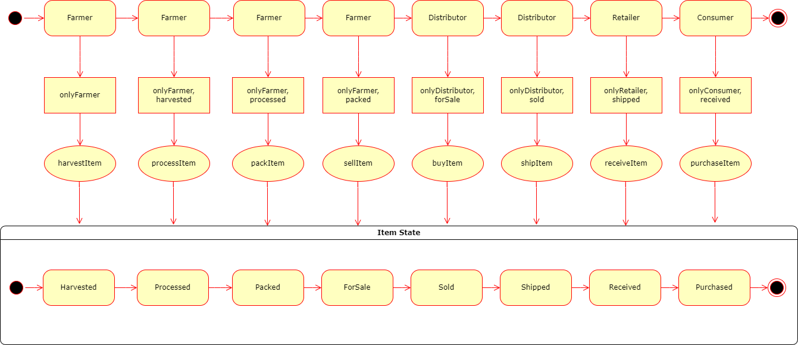
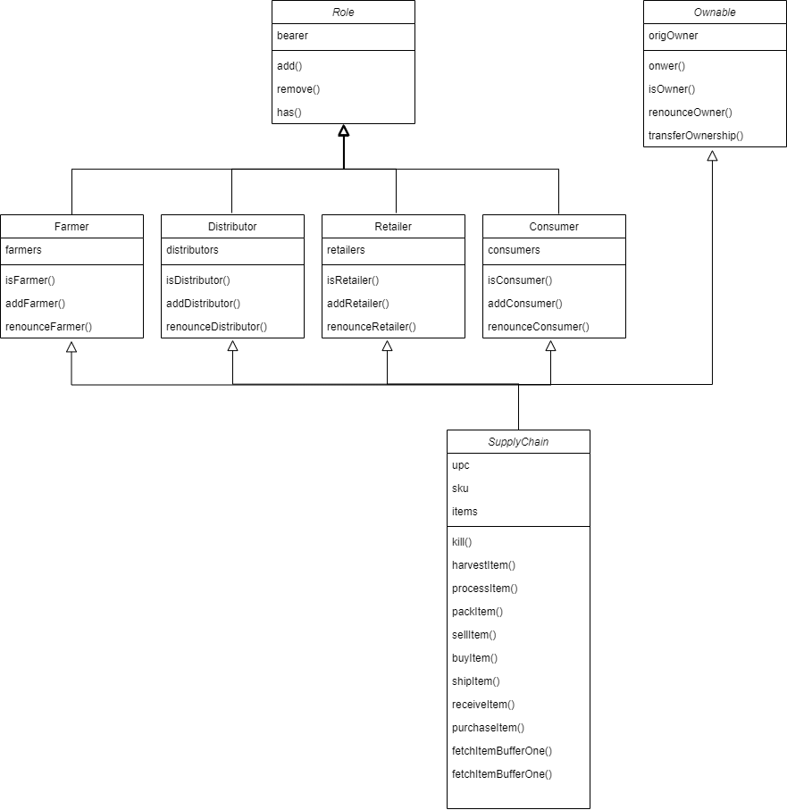

# Project write-up - UML
## Activity

## Sequence

## State

## Classes (Data Model)

# Project write-up - Libraries

* Truffle v4.1.14
* Ganache CLI v6.12.2 (ganache-core: 2.13.2)
* node v10.13.0
* web3 v1.10.2
* truffle-hdwallet-provider v1.0.17

# General Write Up

Deployed on Sepolia: https://sepolia.etherscan.io/tx/0x69f1f1031a4798c0d81902833e96eb37e61c6dafc800d840fae6784bb0821560

* Transaction ID: 0x69f1f1031a4798c0d81902833e96eb37e61c6dafc800d840fae6784bb0821560
* Contract address: 0xe49b858658066f911f93438afdf936ba446ea4b0